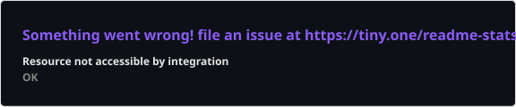

<div align="center">


<br/><br/>


</div>

<br/>

## 👨‍💻 About Me

- 🎓 BCA Graduate with a CGPA of 8.39
- 💼 Full-stack developer skilled in building modern, scalable, and responsive web applications
- 🚀 Currently focused on sharpening problem-solving skills and shipping real-world projects
- 🌐 Comfortable across networking and cybersecurity fundamentals as well as web development
- 📧 Reach me at **lallrohan52@gmail.com**

```json
rohan@cybernexa:~$ whoami
{
  "name": "Rohan Lall",
  "role": "Full-Stack Developer",
  "stack": ["JavaScript", "TypeScript", "React", "Node.js", "Express.js", "MongoDB"],
  "also_know": ["Networking", "Cybersecurity", "Hardware Troubleshooting"],
  "focus": "Building scalable, well-designed web applications",
  "learning": "always",
  "fun_fact": "My code works and I genuinely don't know why — yet."
}
rohan@cybernexa:~$ ▊
```

<br/>

## 🧰 Tech Stack

<div align="center">


</div>

<br/>

## 📊 GitHub Analytics

<div align="center">




<br/>



</div>

<br/>

## 🐍 Contribution Snake

<div align="center">


</div>

<br/>

## 🏆 Featured Projects

- **[Networking Tutorial Website](https://github.com/cybernexa)** — a hop-by-hop guide to OSI/TCP-IP, IP addressing, routing, switching, DNS, and DHCP, with a full login/signup system backed by a local database. Built with HTML, CSS, JavaScript, React, Node.js, Express, MongoDB.
- **Quick Fix Hub** — an Oracle APEX service management and issue-tracking system with user registration, token generation, and an admin dashboard. Built with Oracle APEX, Oracle SQL, JavaScript, HTML, CSS.

<br/>

## 🌐 Connect With Me

<div align="center">

[](https://www.linkedin.com/in/rohan-lall)
[](mailto:lallrohan52@gmail.com)
[](https://github.com/cybernexa)

</div>

<br/>

<div align="center">

⭐ *From curiosity to creation, I build solutions.* ⭐

</div>
