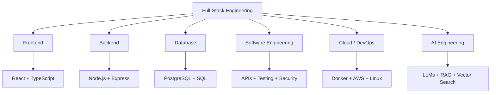

 

---

**Full-Stack Software Developer**
BCA Graduate — Garden City University · CGPA 8.39
Oracle APEX Intern @ Nerds and Geeks

Building full-stack web applications with **React**, **TypeScript**, and **Node.js**, backed by **PostgreSQL/SQL** and **REST APIs**. Working direction includes cloud deployment, containerization, and integrating AI/LLM capabilities into applications.

---

<b>Core Focus</b>

**Frontend:** `HTML5` `CSS3` `JavaScript` `TypeScript` `React.js`
 
**Backend:** `Node.js` `Express.js` `REST APIs`
 
**Databases:** `PostgreSQL` `SQL` `MongoDB` `MySQL`
 
**Cloud & DevOps:** `Docker` `Linux` `AWS` `Git` `GitHub` `CI/CD`
 
**AI Engineering:** `LLM APIs` `Prompt Engineering` `Embeddings` `RAG` `Vector Search`
 
**Computer Science:** `DSA` `OOP` `DBMS` `Operating Systems` `Computer Networks` `Software Engineering` `API Design` `Auth` `Testing`
 
**Additional Languages:** `C` `C++` `Java` `Python`

---

### 1. Full-Stack Business Management System
**Stack:** React · TypeScript · Node.js · Express.js · PostgreSQL · Docker

A full-stack business management application built on a React/TypeScript frontend and a Node.js/Express backend with a PostgreSQL relational database.

> 📌 *Project template — repository details pending. Feature list and links will be finalized once the repository is provided.*

`🔗 Repository: —` · `🔗 Live Demo: —`

---

### 2. AI Knowledge Assistant
**Stack:** React · TypeScript · Node.js · PostgreSQL · LLM APIs · Embeddings · RAG · Vector Search

An AI-powered knowledge platform that enables natural-language interaction with a document or knowledge base, using retrieval-augmented generation for context-aware responses.

> 📌 *Project template — repository details pending. Feature list and links will be finalized once the repository is provided.*

`🔗 Repository: —` · `🔗 Live Demo: —`

---

### 3. Networking Tutorial Platform
**Stack:** React.js · Node.js · Express.js · MongoDB

A responsive educational platform for learning computer networking, covering topics including the OSI Model, TCP/IP, IP Addressing, Routing, Switching, DNS, DHCP, and Network Security. Includes user authentication to access course content.

`🔗 Repository: —` · `🔗 Live Demo: —`

---

### 4. Quick Fix Hub
**Stack:** Oracle APEX · Oracle SQL · JavaScript · HTML · CSS

A service-management and issue-tracking application built on Oracle APEX, featuring user registration, token generation, an admin dashboard, and issue/database management workflows.

`🔗 Repository: —`

---

### 5. Personal Portfolio
**Stack:** HTML · CSS · JavaScript · Node.js · Express.js · MongoDB

A responsive personal portfolio with an interactive UI, project showcase, contact form, and a Node.js/Express backend backed by MongoDB.

`🔗 Live Demo:` [rohan-portfolio-vn8x.onrender.com](https://rohan-portfolio-vn8x.onrender.com)

---

### Oracle APEX Intern
**Nerds and Geeks** · Dec 2025 – Feb 2026

- Developed and maintained web applications using Oracle APEX and MySQL
- Designed and implemented UI components
- Wrote and optimized SQL queries
- Resolved bugs and implemented feature fixes
- Collaborated with the team on project requirements and documented solutions

---

**Bachelor of Computer Applications (BCA)**
Garden City University · CGPA: 8.39

---

---

---

---

*"Build something useful. Understand how it works. Make it better."*

⭐ Thanks for visiting my profile!

